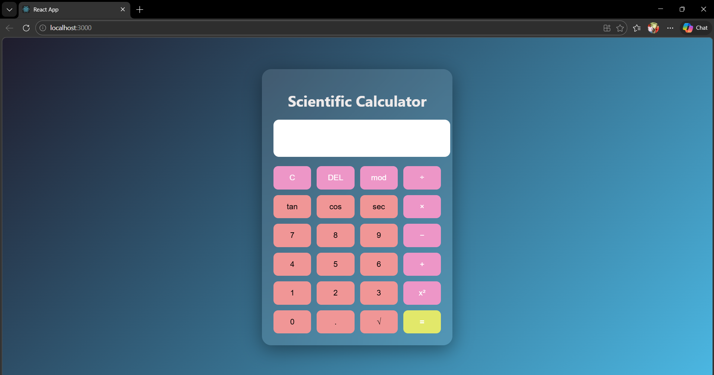

# Ex04 Simple Calculator - React Project
## Date:

## AIM
To  develop a Simple Calculator using React.js with clean and responsive design, ensuring a smooth user experience across different screen sizes.

## ALGORITHM
### STEP 1
Create a React App.

### STEP 2
Open a terminal and run:
  <ul><li>npx create-react-app simple-calculator</li>
  <li>cd simple-calculator</li>
  <li>npm start</li></ul>

### STEP 3
Inside the src/ folder, create a new file Calculator.js and define the basic structure.

### STEP 4
Plan the UI: Display screen, number buttons (0-9), operators (+, -, *, /), clear (C), and equal (=).

### STEP 5
Create a new file Calculator.css in src/ and add the styling.

### STEP 6
Open src/App.js and modify it.

### STEP 7
Start the development server.
  npm start

### STEP 8
Open http://localhost:3000/ in the browser.

### STEP 9
Test the calculator by entering numbers and operations.

### STEP 10
Fix styling issues and refine content placement.

### STEP 11
Deploy the website.

### STEP 12
Upload to GitHub Pages for free hosting.

## PROGRAM
Calculator.js
```
import React, { useState } from "react";
import "./Calculator.css";

function Calculator() {

  const [input, setInput] = useState("");

  const handleClick = (value) => {
    setInput(input + value);
  };

  const clearDisplay = () => {
    setInput("");
  };

  const deleteLast = () => {
    setInput(input.slice(0, -1));
  };

  const calculate = () => {
    try {

      let expression = input
        .replace(/tan/g, "Math.tan")
        .replace(/cos/g, "Math.cos")
        .replace(/sec/g, "(1/Math.cos)")
        .replace(/√/g, "Math.sqrt")
        .replace(/\^/g, "**")
        .replace(/mod/g, "%");

      setInput(eval(expression).toString());

    } catch {
      setInput("Error");
    }
  };

  return (
    <div className="calculator">

      <h1 className="title">Scientific Calculator</h1>

      <input className="display" value={input} readOnly />

      <div className="buttons">

        <button onClick={clearDisplay} className="operator">C</button>
        <button onClick={deleteLast} className="operator">DEL</button>
        <button onClick={() => handleClick("mod")} className="operator">mod</button>
        <button onClick={() => handleClick("/")} className="operator">÷</button>

        <button onClick={() => handleClick("tan(")}>tan</button>
        <button onClick={() => handleClick("cos(")}>cos</button>
        <button onClick={() => handleClick("sec(")}>sec</button>
        <button onClick={() => handleClick("*")} className="operator">×</button>

        <button onClick={() => handleClick("7")}>7</button>
        <button onClick={() => handleClick("8")}>8</button>
        <button onClick={() => handleClick("9")}>9</button>
        <button onClick={() => handleClick("-")} className="operator">−</button>

        <button onClick={() => handleClick("4")}>4</button>
        <button onClick={() => handleClick("5")}>5</button>
        <button onClick={() => handleClick("6")}>6</button>
        <button onClick={() => handleClick("+")} className="operator">+</button>

        <button onClick={() => handleClick("1")}>1</button>
        <button onClick={() => handleClick("2")}>2</button>
        <button onClick={() => handleClick("3")}>3</button>
        <button onClick={() => handleClick("^")} className="operator">x²</button>

        <button onClick={() => handleClick("0")}>0</button>
        <button onClick={() => handleClick(".")}>.</button>
        <button onClick={() => handleClick("√(")}>√</button>
        <button className="equal" onClick={calculate}>=</button>

      </div>

    </div>
  );
}

export default Calculator;
```
Calculator.css
```
body{
  margin:0;
  font-family: 'Segoe UI', sans-serif;
  background: linear-gradient(135deg,#1f1c2c,#4bb7e2);
  height:100vh;
  display:flex;
  justify-content:center;
  align-items:center;
}

.calculator{

  width:360px;
  padding:25px;

  border-radius:20px;

  background:rgba(255,255,255,0.1);

  backdrop-filter:blur(15px);

  box-shadow:0 10px 40px rgba(0,0,0,0.4);
}

.title{
  color:rgb(238, 234, 234);
  text-align:center;
  margin-bottom:20px;
}

.display{

  width:100%;
  height:60px;

  border:none;

  border-radius:12px;

  margin-bottom:20px;

  font-size:24px;

  text-align:right;

  padding:10px;

  background:rgb(255, 255, 255);
}

.buttons{

  display:grid;

  grid-template-columns:repeat(4,1fr);

  gap:12px;
}

button{

  padding:15px;

  font-size:17px;

  border:none;

  border-radius:10px;

  cursor:pointer;

  background:#f09696;

  transition:0.25s;
}

button:hover{

  transform:scale(1.07);

  background:#e4e4e4;
}

.operator{

  background:#ed96c7;

  color:white;
}

.equal{

  background:#e2e86a;

  color:white;

  font-weight:bold;
}
```
App.js
```
import Calculator from "./components/Calculator";

function App() {
  return (
    <div>
      <Calculator/>
    </div>
  );
}

export default App;
```

## OUTPUT



## RESULT
The program for developing a simple calculator in React.js is executed successfully.
